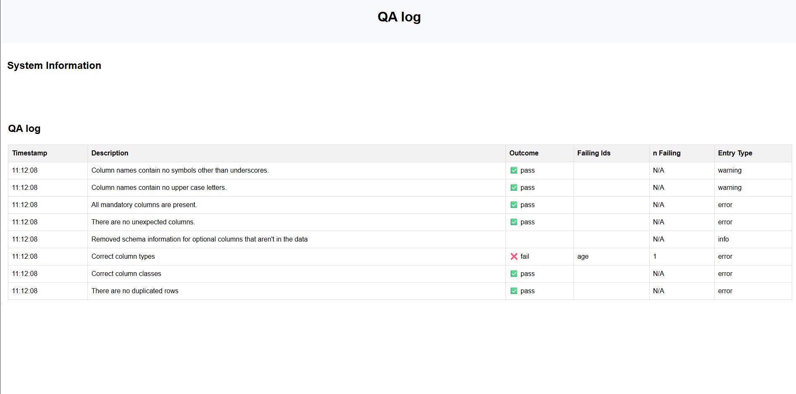
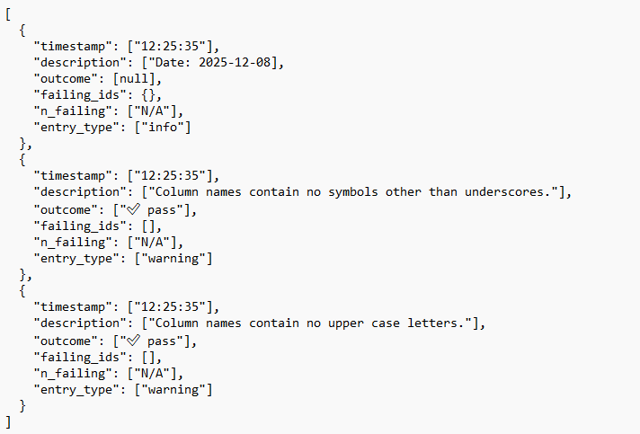

```{r, include = FALSE}
knitr::opts_chunk$set(
  collapse = TRUE,
  comment = "#>"
)
```

```{r setup, include = FALSE}
library(data.checker)
```

## Exporting results

The results from `data.checker` can be exported in html, csv, yaml or json formats and can form part of your QA (quality assurance) logs. We strongly recommend exporting these results along with your analysis outputs so you have a record of which automated checks were done and what they found. Examples of export formats are shown below.

### html

<div class="figure">

</div>

### csv

<div class="figure">

</div>


### json

<div class="figure">

</div>

### yaml

<div class="figure">

</div>
